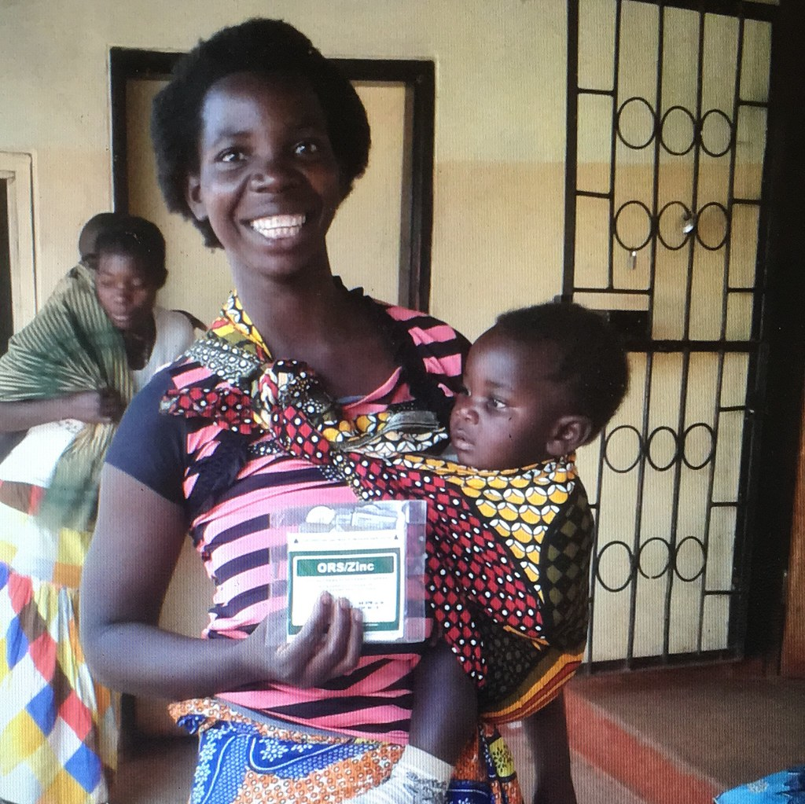
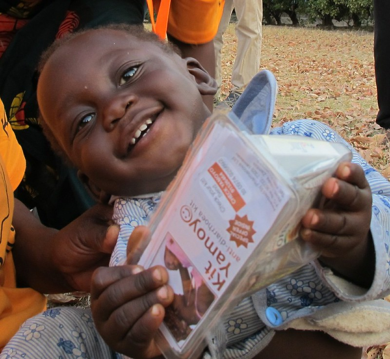

# Correct dispensation of diarrhoea treatment in Zambian children

## Project Background
The project is a collaboration between myself and the UK charity [ColaLife](https://www.colalife.org/), as part of the [Statisticians for Society](https://rss.org.uk/membership/volunteering-and-promoting/statisticians-for-society-initiative/) initiative of the Royal Statistical Society. I am the lead volunteer statistician for the project.

 

 
&emsp; &emsp; &emsp; &emsp;

 
The project focuses on dispensing behaviour of the WHO/UNICEF recommended diarrhoea treatment for children, in rural regions of Zambia. More details follow.

 
 

&emsp; &emsp;

## Project Overview

Diarrhoea is a leading cause of child mortality across developing regions of the world. 
The World Health Organisation (WHO) and UNICEF recommend a simple treatment, recognised as effective in reducing child mortality: 
the parallel administration of Oral Rehidratations Salts (ORS) and zinc tablets. 

Within sub-saharan Africa, the recommended treatment is administered is less than 20% of cases among children under five years of age. Underlying reasons include unawareness of the recommended treatment among dispensing health personnel, who may often dispense just ORS or zinc, even if both elements are in stock.

In Zambia, the charity ColaLife has designed and introduced, in cooperation with the Zambian government, a _single_ pack containing both ORS and zinc: the ***ORS & zinc co-pack***.[^1]
The charity has also gathered data on the treatments dispensed by different health facilities to treat children diarrhoea, both *before* (Oct 2016) and *after* (Oct 2017) the co-pack introduction. In both cases, only facilities where ORS and zinc were also separately available for dispensing were considered. 

<ins>**Objective**</ins>:
The data is used to investigate whether a significantly higher proportion of children have been dispensed the recommended treatment (_i.e._, both ORS and zinc) following the introduction of the co-pack.

### Publication
A scientific article with the results of the analyses is being submitted to an international global health journal for peer-review evaluation. A link to the work will be provided here after publication.

[^1]: Many more details on the decade-long story, including the induced change on WHO guidelines for diarrhoea treatment, can be read [here](https://www.colalife.org/2019/07/09/success-who-adds-co-packaged-ors-and-zinc-to-its-essential-medicines-for-children/). 

***

## Repository Structure and Scripts Summary
   The repository consists of three folders. 
   
   * [`Data folder`](https://github.com/dario-domi/Diarrhoea-Treatment-in-Zambia/tree/master/Data): contains one spreadsheet, reporting diarrhoea-treatment dispensing behaviour in seven Zambian health facilities, before and after the co-pack introduction.
   * [`Code folder`](https://github.com/dario-domi/Diarrhoea-Treatment-in-Zambia/tree/master/Code): contains the R code to perform the statistical analyses of the project and produce associated visualisations.
   * [`Pictures folder`](https://github.com/dario-domi/Diarrhoea-Treatment-in-Zambia/tree/master/Pictures): Figures produced by the R code and used within the submitted manuscript.

The `Code` folder contains four R scripts, which can be run independently of each other.
The scripts are are extensively commented, however a brief overview of each script is included below for convenience.  
* [`1_Data_Preparation.R`](https://github.com/dario-domi/Diarrhoea-Treatment-in-Zambia/blob/master/Code/1_Data_Preparation.R): Reads and cleans the data, preparing them in a format useful for subsequent statistical analyses.
* [`2_Statistical_Analyses.R`](https://github.com/dario-domi/Diarrhoea-Treatment-in-Zambia/blob/master/Code/2_Statistical_Analyses.R): Performs the statistical analyses reported in the publication. 
* [`3_Plots.R`](https://github.com/dario-domi/Diarrhoea-Treatment-in-Zambia/blob/master/Code/3_Plots.R) Creates and saves the figures used in the manuscript.
* [`Intraclass_Corr_Coeff.R`](https://github.com/dario-domi/Diarrhoea-Treatment-in-Zambia/blob/master/Code/Intraclass_Corr_Coeff.R) Defines functions to compute Intraclass Correlation Coefficient via different approaches.

An interactive question at the start of each script allows the user to decide:  
&emsp; 1) whether to print results to standard output in a readable format (Scripts 1 & 2) 
&emsp; 2) whether plots should have a dark or light background (Script 3).

## Download/Clone the Repository
Follow the relevant step below to download or clone the repository onto your local machine.

1. <ins>**Download**</ins>: Click onto the green `<> Code` button and select 'Download ZIP'.
2. <ins>**Clone**</ins>: Open Git Bash or the Windows PowerShell if using Windows (or the terminal if using Linux/Mac), `cd` into the desired folder and type
   `git clone https://github.com/dario-domi/Diarrhoea-Treatment-in-Zambia.git`.
   
You can now run the scripts in your own R/RStudio. 

